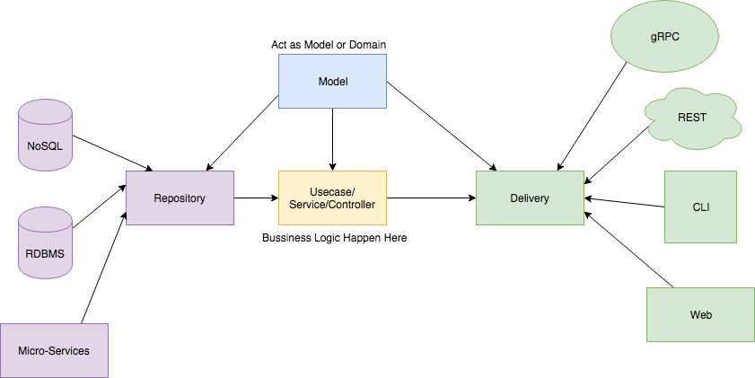

# Slack application: Warning Shot

TODO

## Architecture

 * Independent of Frameworks. The architecture does not depend on the existence of some library of feature laden software. This allows you to use such frameworks as tools, rather than having to cram your system into their limited constraints.
 * Testable. The business rules can be tested without the UI, Database, Web Server, or any other external element.
 * Independent of UI. The UI can change easily, without changing the rest of the system. A Web UI could be replaced with a console UI, for example, without changing the business rules.
 * Independent of Database. You can swap out Oracle or SQL Server, for Mongo, BigTable, CouchDB, or something else. Your business rules are not bound to the database.
 * Independent of any external agency. In fact your business rules simply don’t know anything at all about the outside world.

More at https://8thlight.com/blog/uncle-bob/2012/08/13/the-clean-architecture.html

This project has  4 Domain layer :
 * Models Layer
 * Repository Layer
 * Usecase Layer  
 * Delivery Layer
 


## Makefile

If you execute:

```make help```

You will see all enable commands.

Executing tests:

```make test```

Quality tools:

```make lint```

Continuous integrations (lint and tests):

```make ci```

Build the project with the short version of the sha1 of your latest:

```make build```

Remove temporary files generated by go:

```make clean```

## Go commands 

#### Dependencies: go mod

Go Mod:

https://github.com/golang/go/wiki/Modules#modules

Generate go.mod:

```go mod init``` 

Downloads dependencies:

```go build```

Generate vendor:

```env GO111MODULE=on go mod vendor```

#### FORMAT CODE

```go fmt main.go```

#### BUILD

```go build```

#### RUN

```PORT=7000 ./warning-shot```

or

```source .env```
```./warning-shot```

#### CODE REVIEWS GOLANG

https://github.com/golang/go/wiki/CodeReviewComments

#### Set the build id using git´s SHA

You can get the short version of the sha1 of your latest commit by running the following git command from your repo:

```git rev-parse --short HEAD```
```go build -ldflags "-X main.Build=a1064bc" main.go```


#### TEST

```go test <folder>```

```go test ./config```

Text format:

```go test ./config -coverprofile fmt```

Html format:

```go test ./config -coverprofile coverage/cover.out```
```go tool cover -html=coverage/cover.out -o coverage/cover.html```

#### DOCKER

In order to work with docker container you must create first a custom network to link services:

```
$ docker network create dev-network
$ docker-compose up -d 
```
